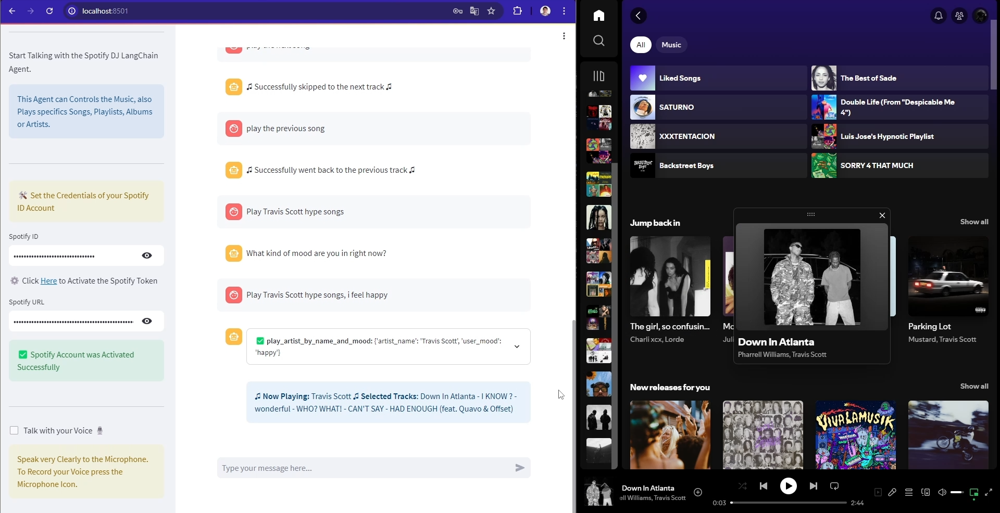

# Spotify DJ Agent with LangChain

## LangChain Spotify DJ Agent Powered by Gemini-Pro and Streamlit

This is a Spotify DJ Agent Built with LangChain, is Powered by using the Gemini-Pro LLM. This Agent can Controls the Music, also Plays specifics Songs, Playlists, Albums or Artists. 

The User can also Request for Songs Recommendations, based on Mood, Artists, Songs or Genre.

## Preview

- App Preview: https://youtu.be/Y-X3kbWDMdM

## Connect
- Linkedin: https://www.linkedin.com/in/luis-jose-mendez/
- GitHub: https://github.com/mendez-luisjose
